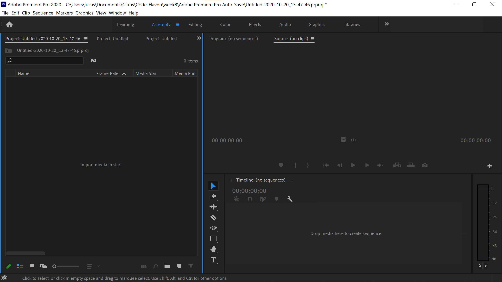
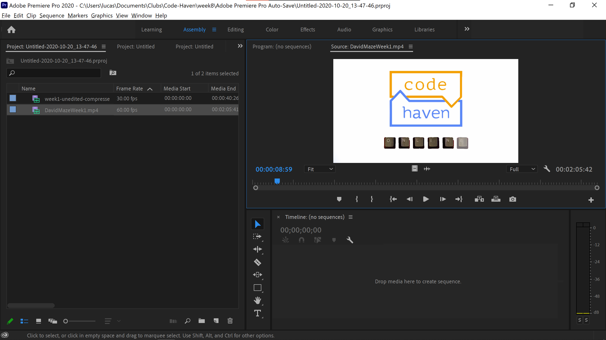
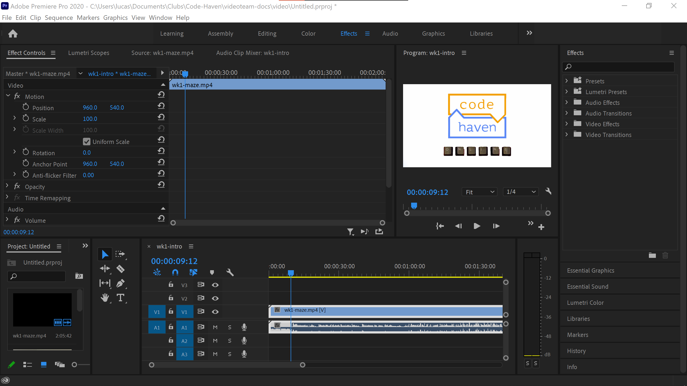
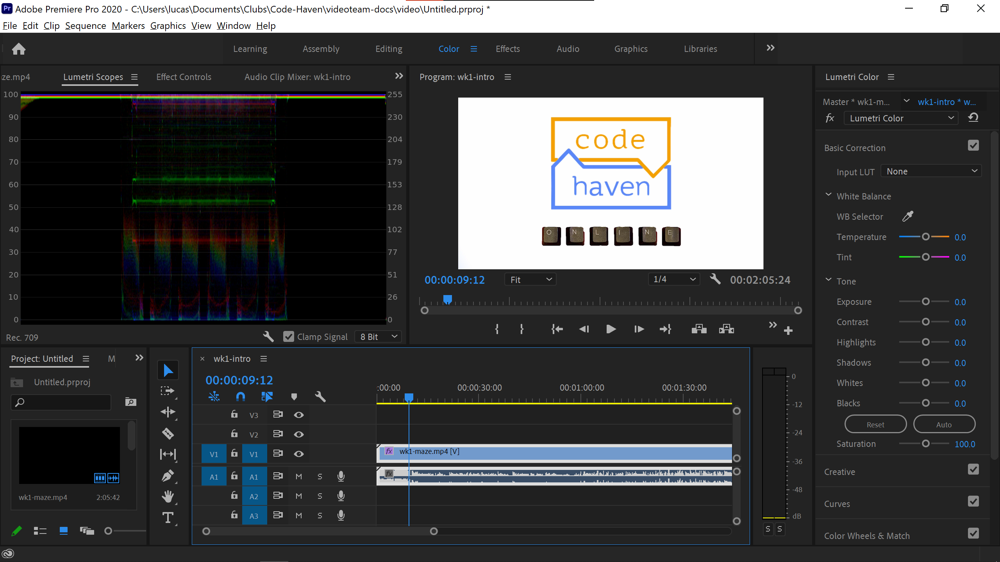
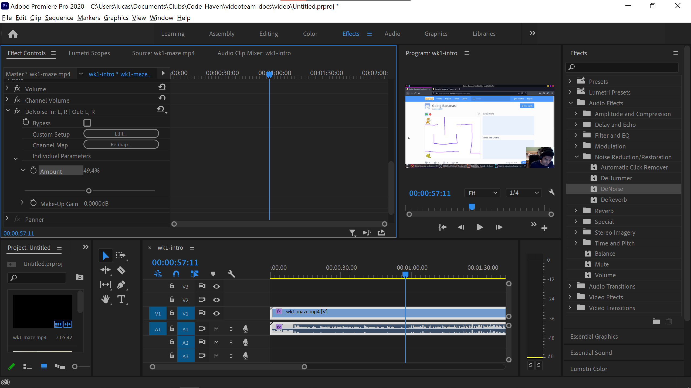

# Video Team - Intro to Premiere Pro

## Project Basics

Adobe Premiere Pro saves video information inside a "Project," which is a designated folder in your computer with a `.prproject` file. Projects are a big high-level container for all your video, audio, images, etc. A "Sequence," on the other hand, is a specific collection of these assets, with edits and effects and all those bells and whistles. A sequence also maintains information like aspect ratio, frame rate, and what have you. Sequences are what you actually end up exporting into a video format like `.mp4`, whereas the project itself is just, again, a big collection of stuff.

### Getting started
Create a new folder on your computer. Add all files you'll be using, including video, audio, and images, to  this folder. Now in Premiere Pro, select `File > New > Project`, and browse to the folder you just created. Sweet!

Useful shortcuts
* `Hold Alt while scrolling`: zoom in/out
* `Spacebar`: preview
* `Enter`: cache effects for seamless playback

### The Assembly Layout

*Layouts are pre-set arrangements of various Premire widgets. In this case, we're using the "Assembly" layout. If you click Window on the headerbar (the bar way up top that has File, Edit, etc), you can enable/disable different widgets and create your own custom layouts.*

Way up top you'll see a few different layout options. For now, make sure "Assembly" is selected. Right-click on the big box to the left that says "Import media to start," and select Import. Now, select all the assets for this project. They should now be showing up on the left-hand side. Double-click one of them and your project screen should now look something like this:

*This might look slightly different for you. Specifically, the clips on the left side likely have an image preview. You can change this by clicking on the icons in the bottom-left corner, pick whatever you prefer!*

Note that big bar underneath the clip, on the right-hand side. This is where you should initially select what parts of the clip you'd like to import into your project. Hit `Spacebar` to preview the clip, select the In point by clicking on a point in the timeline and pressing `I` on your keyboard, and select the Out point by pressing `O` on your keyboard. Once you've selected the parts you want, click on the clip and drag it down into the bottom widget that says "Drop media here to create sequence." This widget is called the Timeline.

### The Editing Layout

Once you've dragged a clip onto the Timeline, notice how on the left side a new asset appears. This is the Sequence you just created! It houses all the edits you'll be making to the clip you just dragged in. Sweet! Let's get to work. Way up above, select the "Editing" layout. This should split the left widget into two whole new widgets. This is where you'll be spending 99.9% of your time editing videos. The Editing layout includes the most stuff. You can import clips, chop them up, add effects, and what have you.

### The Effects Layout
Select the Effects Layout way up above. Your screen should now look something like this:

This is where you can apply effects to a clip. All video clips already come with a few different effects, namely "Motion," "Opacity," and "Time Remapping" for video effects, and "Volume," "Channel Volume," and "Panner" for audio effects. Notice how if you, for example, change the first "Position" attribute inside the "Motion" effect, the scene moves along the x-axis. You can change this value either by clicking on it and writing a new value, or by holding down on the value and dragging to the left/right. You can also add more effects by dragging them in from the right-hand "Effects" pane. We'll get more into the weeds in a bit.

## Editing Walkthrough

Download [this zip file](), unzip it, and let's get to work.

* Cut at 00:03 and apply Morph Cut transition

### Color Correction

Ideally, a clip should be filmed in such a way that no color correction is necessary. But we have crappy phone cameras, i.e. color correction is always going to help make the clip look nicer.

Select the "Color" layout from the bar way up above. Your screen should look like this: 

There's a lot to unpack here. **insert my crummy explanation here.**

### Noise filter
Your mic probably sucks. My mic definitely sucks. It sucks so much that when trying to capture my voice the microphone's own wiring can generate electromagnetic fields that mess up the current carrying recorded audio data. This generates audible whirring and whining. You might also find that heaters, fans, cars and insects create a ton of background noise that your microphone loves to emphasize. This is where noise filters come in. Hint: Premiere makes this ridiculously easy.

In the Effects tab, search up "DeNoise." You can also find it under `Audio Effects > Noise Reduction/Restoration`. Drag the effect onto your video. Now, find the effect in the Effect Controls tab, open up "Individual Parameters," and click on the little arrow to the left of "Amount." This'll open a scrollbar. Simply drag this up enough such that you can't hear the noise, while keeping the clip's audio sounding nice. Easy as that.

## Appendix A: Lit Pre-Made Effects

### Video Transitions

| Effect | Category | Description | Usage
|---|---|---|---|
| Morph Cut | Dissolve | Generates frames that smooth out the transition between two clips | Make jump-cuts less jarring, morph squares into circles, and other shenanigans |
| A | S | D | F |
| Z | X | C | D |

### Audio
| Effect | Category | Description | Usage
|---|---|---|---|
|  | Transition | Generates frames that smooth out the transition between two clips | Make jump-cuts less jarring, morph squares into circles, and other shenanigans |
| A | S | D | F |
| Z | X | C | D |

## Appendix B: Timeline Tools

tl;dr
* Will be using all the time: V, C, T
* Situationally very useful: R, Y, P
* The rest: B, N, U

| Tool | Shortcut | Mnemonic | Usage
|---|---|---|---|
| Selection | V | V looks like an arrow! | Select stuff. lol.
| Ripple Edit | B | idk lol | When you resize a clip with this tool, the clip's new starting frame will remain in the same place in the sequence. |
| Rolling Edit | N | Rolli**N**g, I guess? | Mirrors changes on one clip to another. For instance, if you have two clips back-to-back and you ripple edit the first clip to reduce it's length, the second clip's length will be increased to fill in the gap.|
| Rate Stretch | R | **R**ate, duh | When you resize a clip with this tool, the clip will still contain the same footage, but sped up or slowed down to match the new size.
| Razor | C | **C**ut | Slices a clip at the point you clicked. Slicing can be undone if you right-click slice and select "Join Through Edits."
| Slip | Y | Being slippery makes me go **Y**es | Click and drag left/right on a clip to fine-tune the start and end frames, while keeping the overall length of the clip the same.
| Slide | U | **U**uuuuu a slide, cool| When dragging a clip with this tool, surrounding clips' lengths will be increased/reduced to match, but the dragged clip will remain the same.
| Pen/Rectangle/Ellipse | P | **P**en | Draw shapes! |
| Type | T | **T**ext | Write text!

## Appendix C: fps, resolution, aspect ratio, file formats, codecs???